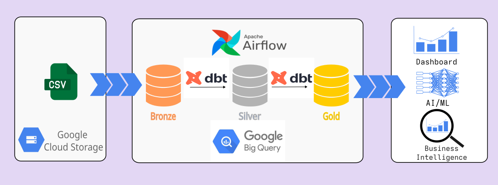
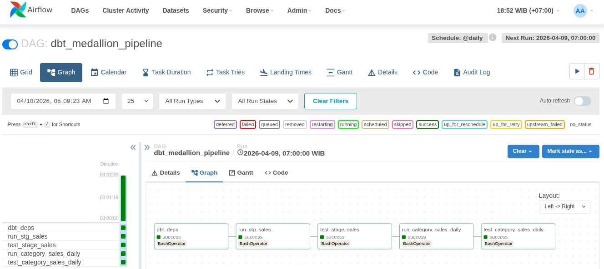
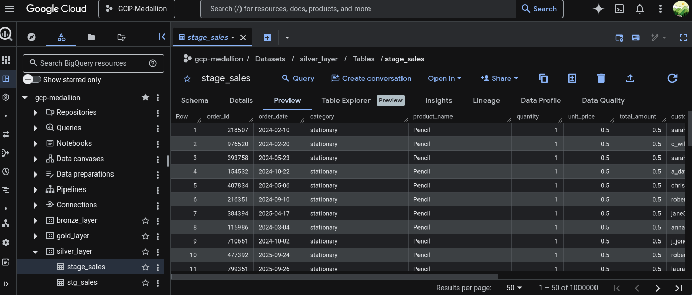
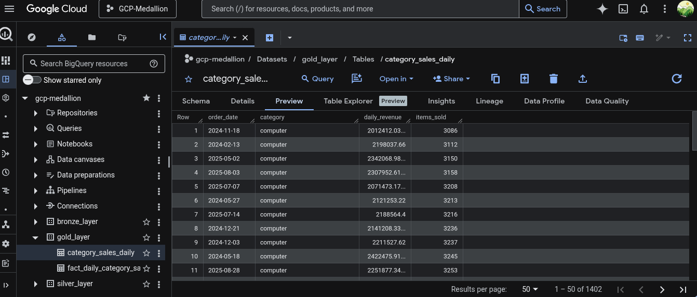
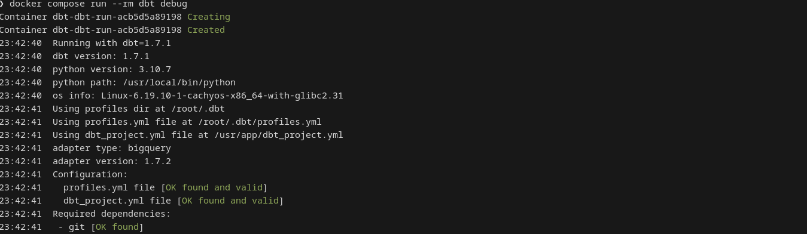
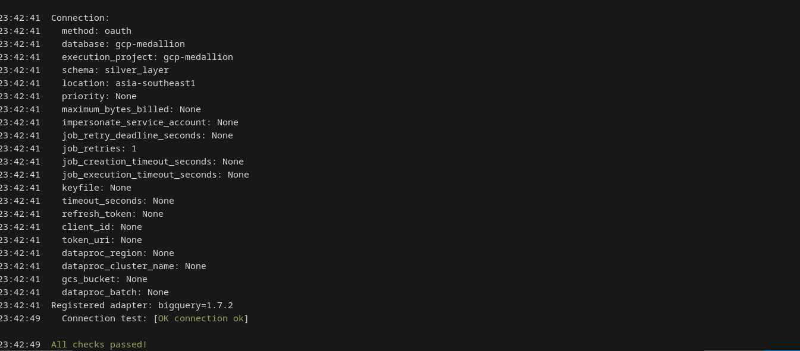

# GCP Medallion Architecture
<b>Implementation Medallion Architecture on GCP</b><br>

## *Project Overview*
Implementing Medallion Architecture on Google Cloud Platform (GCP) by using BigQuery as Bronze-Silver-Gold layer, orchestrate the all processes with Apache Airflow, transformation and test proceses using dbt in docker contenerized. The pipeline begins with Airflow DAGs ingesting raw data into BigQuery (Bronze), followed by dbt models that clean and normalize data into a relational format (Silver), and finally aggregate it into business-ready tables (Gold).
## *Problem To Be Solved*
Implementing this specific stack addresses the "Data Swamp" problem — where data is technically available but practically unusable due to inconsistent quality, high latency, and fragile infrastructure.<br>
Without this architecture, data platforms typically suffer from three core failures:
1. <b>The Quality Gap (The "Garbage In, Garbage Out" Problem)</b><br>
   In a flat data warehouse, raw logs and refined business metrics often live in the same space. If a source API changes its schema, downstream dashboards break immediately.
     - <b>The Medallion Solution</b>: By enforcing a Silver layer, you create a mandatory "quality gate" where data is cleaned, typed, and deduplicated before it ever touches a business report.
2. <b>The Dependency Nightmare (Orchestration Friction)</b><br>
  As a data platform grows, managing the order of operations becomes impossible. If you run a transformation before the data has finished loading, your reports show yesterday's numbers.<br>
     - <b>The Airflow/dbt Solution</b>: Airflow handles the "when" (scheduling and cross-system triggers), while dbt handles the "how" (SQL logic and intra-warehouse dependencies). Together, they ensure that a Gold-layer table only updates after its Bronze and Silver parents have successfully refreshed.
3. <b>"It Works on My Machine" (Environment Drift)</b><br>
Infrastructure fragility is a major bottleneck. A data engineer might write a pipeline that works locally but fails in production because of a different Python version or a missing dbt plugin.<br>
     - <b>The Docker Solution</b>: By wrapping the entire stack in Docker, you guarantee that the logic running on your laptop is identical to what runs in GCP. This eliminates deployment "surprises" and allows for easy scaling on Google Kubernetes Engine (GKE).<br>
     - <b>The Bottom Line</b>: You are solving for Trust. By implementing this, you move from a reactive state (fixing broken dashboards) to a proactive state (delivering verified, version-controlled data assets).
## *Business Leverage & Impact*
1. <b>Radically Reduced "Time-to-Insight"</b><br>
By using dbt with Airflow, you replace weeks of manual SQL scripting with a modular, version-controlled framework.<br>
      - <b>The Leverage</b>: When a stakeholder asks for a new metric, you don't build a new silo. You simply add a layer to your existing Gold models. The automated testing ensures that new changes don't break old reports, allowing your team to ship updates daily rather than monthly.
2. <b>Elimination of "Decision Friction"</b><br>
Discrepancies between departments (e.g., Marketing and Finance reporting different "Active User" counts) create organizational paralysis.<br>
      - <b>The Business Impact</b>: The Silver layer acts as the "Universal Translator." It forces a single definition of truth across the company. When everyone trusts the dashboard, meetings move from "where did this number come from?" to "what should we do about this number?"
3. <b>Cost-Efficient Scalability</b><br>
Without this architecture, GCP costs often spiral because inefficient queries scan entire raw datasets repeatedly.<br>
      - <b>The Leverage</b>: By "landing" data once in Bronze and refining it into partitioned/clustered Gold tables, you optimize BigQuery compute. Docker ensures your orchestration costs are predictable—you aren't locked into expensive proprietary tools and can scale your infrastructure up or down in minutes without rewriting code.
## *Project Prerequition*
1. Installed docker on your system (cachyos)
   ```bash
   ❯ sudo pacman -S docker docker-compose buildx

   # verify installation
   ❯ docker --version
   Docker version 29.3.1, build c2be9ccfc3

   ❯ docker compose version
   Docker Compose version 5.1.1 
   ``` 
3. Build airflow docker with the dependencies: <i>docker cli & docker compose</i>
   ```nvim
   # Dockerfile
   FROM apache/airflow:2.8.0
   ...
   # Docker CLI
   RUN apt-get install -y docker-ce-cli
   ...
   # docker compose
   RUN curl -SL "https://github.com/docker/compose/releases/download/v2.24.0/docker-compose-linux-x86_64" \
       -o /usr/local/lib/docker/cli-plugins/docker-compose
   ....
   ```
4. Build dbt docker with the dependebcies: <i>dbt-bigquery & google cloud sdk</i>
   ```nvim
   # Dockerfile
   FROM ghcr.io/dbt-labs/dbt-bigquery:1.7.2
   ...
   # Install Google Cloud SDK
   RUN curl -sSL https://sdk.cloud.google.com | bash
   ...   
   ```
5. Setup IAM & Admin/Service Account
   - Login to: console.google.cloud.com
   - Choose menu: IAM & Admin > Service Account > Create service account
   - Manage access:
      - BigQuery Data Editor
      - Bigquery Data Viewer
      - BigQuery Job User 
   
7. Install google cli
   ```bash
   # Install google-cloud-cli   
   ❯ yay -S google-cloud-cli

   ❯ gcloud --version
   Google Cloud SDK 563.0.0
   alpha 2026.03.27
   beta 2026.03.27
   core 2026.03.27
   gcloud-crc32c 1.0.0
   gsutil 5.36
   preview 2026.03.2

   # Initialize the CLI
   ❯ gcloud init
   
   # 1. Select account
   # 2. Pick cloud project to use
   # 3. Configure Compute Region and Zone  
   ```
## *Project Flow*
1. Load CSV file into <b>GCS Bucket</b>
2. Data Ingestion: running <b>Airflow</b> <i>gcs_to_bronze_dag.py</i> to load data from GCS to <b>Bronze Layer</b>
3. Data Cleansing <b>(Silver Layer)</b>, Data Transformation <b>(Gold Layer)</b> and Data Testing within: running <i>dbt_medallion_dag.py</i> 
4. Checking the result in BigQuery
## *GCP-dbt Hierarchy*
   ```bash
   gcp_dbt
├── dbt_project.yml
├── docker-compose.yml
├── gcp-creds.json
├── Dockerfile
├── profile.yml
│
├── models/
│   ├── sources.yml              # declares existing BigQuery tables (bronze/silver/gold)
│   │
│   ├── bronze/                  # reads from raw sources
│   │   └── bronze_sales.sql
│   │
│   ├── silver/                  # transforms bronze → silver
│   │   ├── schema.yml           # tests & docs for silver models
│   │   └── stage_sales.sql
│   │
│   └── gold/                    # transforms silver → gold
│       ├── schema.yml           # tests & docs for gold models
│       └── category_sales_daily.sql
│
├── tests/                       # custom data tests
│   └── assert_positive_revenue.sql
│
├── macros/                      # reusable jinja/SQL macros
│   └── generate_schema_name.sql
│
├── seeds/                       # static CSV data loaded to BQ
│   └── country_codes.csv
│
└── target/                      # auto-generated, add to .gitignore
   ```
## Screenshot
### Apache Airflow

### BigQuery Silver Layer

### BigQuery Gold Layer

### dbt connection check


